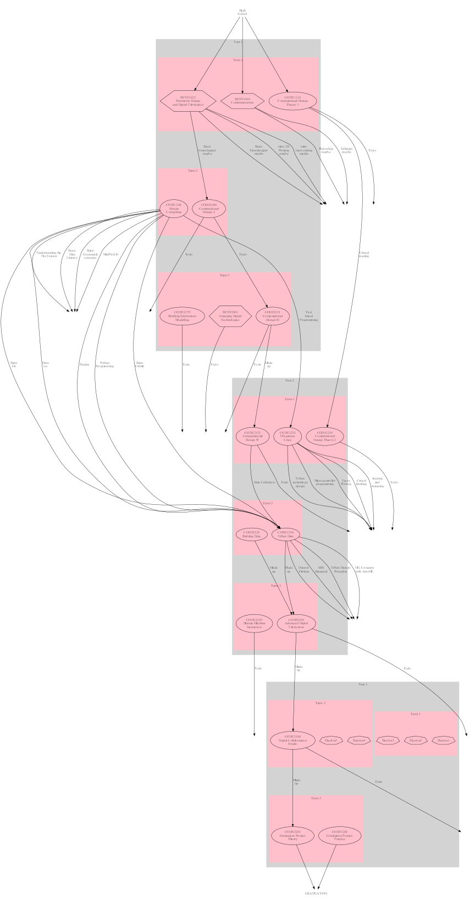

# CoDe Graph

This is a very nerdy attempt to map the skills that flow through the CoDe course. At the moment it looks like this:

This is mainly so that I (Ben) can understand what skills I need to export from 1161 (Design Computing) so that the students are well placed to do a good job in their subsequent courses.

But, it might be useful for other people to look at. I'm not sure how correct it is as I built it off an oldish map of the course.

You can copy the contents of the `code.dot` file and paste it into this site: https://dreampuf.github.io/GraphvizOnline

It's a bit painful to work with, but the layout engine is amazing, and once there's a tonne of data in there we can make it look pretty in a manual tool.

I've done most of the work of structuring and formatting the graph, so you needn't worry too much about that. But, you can add new edges so that the graph gets more useful.

It's a bit messy at the moment because it's got a _lot_ pointing at dummies. I've done this so that it's got most of the structure in place for others to edit, and it'll get _way_ tidier as we start to fill it in.

The only bit you need to understand is that to draw an edge from x to y, you'd do:

    x -> y

but we're interested in what the skill actually is, so you'd do:

    x -> y [label="the skill\non another line"]

N.B. `\n` is a new line marker so we can keep things all on one line in the file.

Each course exports multiple skills, so we can do this:

    x -> y [label="being\ncool"]
    x -> y [label="being\smart"]
    x -> z [label="matching belt\nand shoes"]

I've made a couple of temporary conventions. If you're sure what your course exports, but not where it goes, make it go to a dummy, e.g. 

    dummy1161 [label="_"]
    CODE1161 -> dummy1161 [label="Github"]
    dummy1161 -> knowledgeBank

Then the dummy connects to the `knowledgeBank` which connects to the graduation courses (the pinnacle of all knowledge).

Once you've made some changes and want to contribute them back, to this repo just use the 🖊️ icon to paste your code over the top of mine, make a comment, and then I'll merge the two into each other.

This is a very incomplete sketch, so if you think there's something you want to work through, call me on teams and let's talk it through together. 